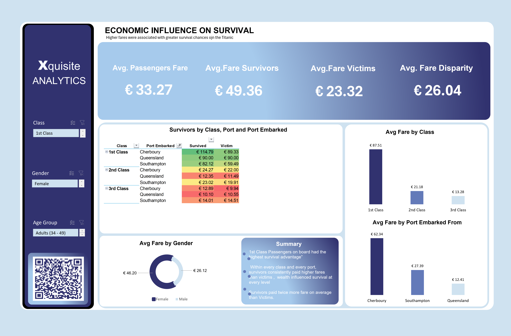

# 🚢 RMS Titanic Survival Analysis

> *Could Passenger Class, Gender and Age have been a common pattern among Survivors?*  
> *Higher fares were associated with greater survival chances.*


---

## 📌 Project Overview

On **April 15, 1912**, the RMS Titanic sank during her maiden voyage from Southampton, England to New York City after striking an iceberg in the North Atlantic Ocean. The disaster claimed over 1,500 lives — one of the deadliest peacetime maritime disasters in history.

This project revisits the tragedy through **data analytics**, using **Microsoft Excel** as the sole tool for data cleaning, transformation, analysis, and visualization. The goal is to determine whether passenger class, gender, age, and fare paid significantly influenced **who survived and who perished**.

**Two interactive dashboards** tell the complete story:
- **Dashboard 1** — Survival patterns by Class, Gender & Age
- **Dashboard 2** — Economic influence on survival (fare analysis)

---

## 📊 Key Metrics at a Glance

| Metric | Value |
|--------|-------|
| Total Passengers | 1,309 |
| Total Survivors | 500 |
| Survival Rate | **38%** |
| Death Rate | **62%** |
| Avg Fare (Survivors) | **€49.36** |
| Avg Fare (Victims) | **€23.32** |
| Fare Disparity | **€26.04 (+112%)** |

---

## 🗂️ Repository Structure

```
titanic-survival-analysis/
│
├── data/
│   ├── titanic_raw.csv                     # Original Kaggle dataset (1,309 rows)
│   └── titanic_cleaned.xlsx                # Cleaned dataset with Power Query steps
│
├── dashboards/
│   └── titanic_dashboard.xlsx              # Interactive Excel dashboards (2 pages)
│
├── docs/
│   └── titanic_project_documentation.docx # Full project documentation
│
├── web/
│   └── titanic_operation_rescue.html       # QR code landing page
│
├── assets/
│   ├── dashboard_1_preview.png             # Survival Analysis dashboard screenshot
│   └── dashboard_2_preview.png             # Economic Influence dashboard screenshot
│
└── README.md
```

---

## 🧹 Data Cleaning & Transformation

All cleaning was performed in **Microsoft Excel.

### Missing Value Treatment

| Column | Missing | % Missing | Resolution |
|--------|---------|-----------|------------|
| Age | 263 | 20.1% | Median imputation grouped by Pclass & Sex |
| Cabin | 1,014 | 77.5% | Excluded — too sparse for analysis |
| Embarked | 2 | 0.15% | Replaced with mode value ('S' — Southampton) |
| Fare | 1 | 0.08% | Replaced with class-level median |

### Engineered Columns

Six new columns were created using Excel formulas and Power Query:

| New Column | Formula Logic | Purpose |
|-----------|---------------|---------|
| `Survived_Label` | `IF(Survived=1,"Survived","Victim")` | Readable chart labels |
| `Class_Label` | Nested `IF` on Pclass | Full class name display |
| `Age_Group` | Nested `IF` on Age ranges | Life-stage segmentation |
| `Port_Full` | `SWITCH` on Embarked code | Full port names |
| `Family_Size` | `SibSp + Parch + 1` | Total family unit size |

### Age Group Definitions

| Group | Age Range |
|-------|-----------|
| Children | 0 – 16 |
| Youths | 17 – 33 |
| Adults | 34 – 49 |
| Middle Aged | 50 – 64 |
| Elderly | 65+ |

---

## 📈 Dashboard 1 — Survival Analysis


> *Survival by Class, Gender & Age Group*

### Survival by Passenger Class

| Class | Passengers | Survived | Perished | Survival Rate |
|-------|-----------|---------|---------|--------------|
| 1st Class | 323 | 200 | 123 | **62%** |
| 2nd Class | 277 | 119 | 158 | **43%** |
| 3rd Class | 709 | 181 | 528 | **25%** |
| **Total** | **1,309** | **500** | **809** | **38%** |

> 💡 **Insight:** 1st Class passengers survived at a rate **2.5× higher** than 3rd Class (62% vs 25%). Despite comprising 54% of all passengers, 3rd Class accounted for 65% of all victims.

### Survival by Gender

| Gender | Passengers | Survived | Perished | Survival Rate |
|--------|-----------|---------|---------|--------------|
| Female | 466 | 339 | 127 | **73%** |
| Male | 843 | 161 | 682 | **19%** |

> 💡 **Insight:** Female passengers survived at nearly **4× the rate** of male passengers (73% vs 19%). The *"women and children first"* maritime evacuation protocol demonstrably shaped outcomes.

### Survival by Age Group

| Age Group | Total | Survived | Perished | Survival Rate |
|-----------|-------|---------|---------|--------------|
| Children (0–16) | 134 | 74 | 60 | **55%** |
| Youths (17–33) | 532 | 280 | 252 | **53%** |
| Adults (34–49) | 253 | 102 | 151 | **40%** |
| Middle Aged (50–64) | 97 | 42 | 55 | **43%** |
| Elderly (65+) | 13 | 2 | 11 | **15%** |

> 💡 **Insight:** Children had the highest survival rate (55%) thanks to evacuation priority. Only **2 of 13** elderly passengers (65+) survived — a 15% rate, the lowest of any group.

---

## 💰 Dashboard 2 — Economic Influence on Survival



> *Higher fares were associated with greater survival chances*

### Fare KPIs

| Metric | Value |
|--------|-------|
| Avg Passenger Fare | €33.27 |
| Avg Fare — Survivors | **€49.36** |
| Avg Fare — Victims | **€23.32** |
| Fare Disparity | **€26.04** |

### Fare by Class, Port & Outcome

| Class | Port | Survived (Avg Fare) | Victim (Avg Fare) |
|-------|------|--------------------|--------------------|
| 1st Class | Cherbourg | €114.79 | €89.33 |
| 1st Class | Queensland | €90.00 | €90.00 |
| 1st Class | Southampton | €82.12 | €59.49 |
| 2nd Class | Cherbourg | €24.27 | €22.00 |
| 2nd Class | Queensland | €12.35 | €11.49 |
| 2nd Class | Southampton | €23.02 | €19.91 |
| 3rd Class | Cherbourg | €12.89 | €9.94 |
| 3rd Class | Queensland | €10.10 | €10.55 |
| 3rd Class | Southampton | €14.01 | €14.51 |

> 💡 **Insight:** In nearly every class-port combination, survivors paid **higher fares** than victims. Wealth provided a survival advantage at the micro-level — not just between classes, but within them.

### Avg Fare by Gender

| Gender | Avg Fare |
|--------|----------|
| Female | **€46.20** |
| Male | **€26.12** |

---

## 🔍 Key Findings

1. **Class privilege was a matter of life and death** — 1st Class passengers survived at 62%, more than 2.5× the 3rd Class rate of 25%. The ship's architecture reinforced social hierarchy: upper-deck cabins meant faster lifeboat access.

2. **Gender was the single strongest individual predictor** — Women survived at 73%; men at just 19% — a 54 percentage point gap. The *"women and children first"* protocol was actively enforced and shows unmistakably in the data.

3. **Economic power compounded survival advantage** — Survivors paid more than twice what victims paid (€49.36 vs €23.32). This held within every class and every port — wealth bought survival in the most literal sense.

4. **Age ran from favoured (children) to most disadvantaged (elderly)** — Children benefited from evacuation priority. Only 2 of 13 elderly passengers (65+) survived — a 15% rate, the lowest of any group.

5. **Port of embarkation reflected class composition** — Cherbourg passengers paid the highest average fares (€62.34 avg) and had the best survival outcomes, driven by a heavily 1st Class composition.

---

## ⚠️ Limitations

- **Age imputation:** 263 values (20%) were imputed using class- and gender-grouped medians. Some imprecision in age-based analysis is possible.
- **Cabin data:** 77.5% missing — deck-level proximity analysis was not feasible.
- **Passengers only:** No crew data is included in this dataset.
- **Correlation ≠ Causation:** All findings are patterns and associations, not causal claims.
- **Currency:** Fares are in 1912 British pounds, used only for relative comparison.

---

## 🛠️ Tools & Skills Demonstrated

| Tool / Skill | Application |
|-------------|-------------|
| **Excel Formulas** | `IF`, nested IFs for feature engineering |
| **Pivot Tables** | Multi-dimensional aggregation by class, gender, age, port, outcome |
| **Excel Charts** | Clustered bars, stacked bars, doughnut charts |
| **Dashboard Design** | Two-page interactive dashboards with Slicers for dynamic filtering |
| **Data Storytelling** | Structured narrative from problem statement through insight to conclusion |

---

## 🚀 How to Use

1. **Clone the repo**
   ```bash
   git clone https://github.com/Teekay-bee/titanic-survival-analysis.git
   cd titanic-survival-analysis
   ```

2. **Interact with the dashboards**  
   Open `dashboards/titanic_dashboard.xlsx` → use the **Slicers** (Class, Gender, Age Group) to filter all charts dynamically

3. **Scan the QR code** on the dashboard to open the web summary page

> **Requirements:** Microsoft Excel 2019 or later. No additional software, scripts, or packages required.

---

## 📬 Connect

**Author:** Teekay-bee  
**Project:**  RMS Titanic Survival Analysis  
**Date:** April 2026

If you found this useful, feel free to ⭐ **star the repo** or open an issue with feedback!

---

*"The Titanic's lifeboats were not allocated by luck — they were, in effect, priced."*
